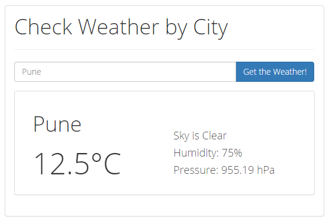
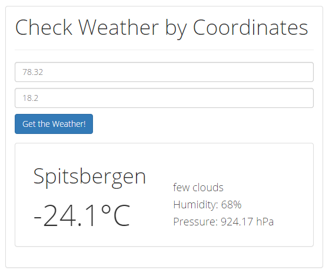

# API Key
Register yourself with openweathermap.org to get your API key and replace the
<API_KEY> string in scripts/services/weather.js
# Weather
Angular webapp, allows to search for local weather by city name or by latitude
and longitude coordinates. 

Snapshots
============

